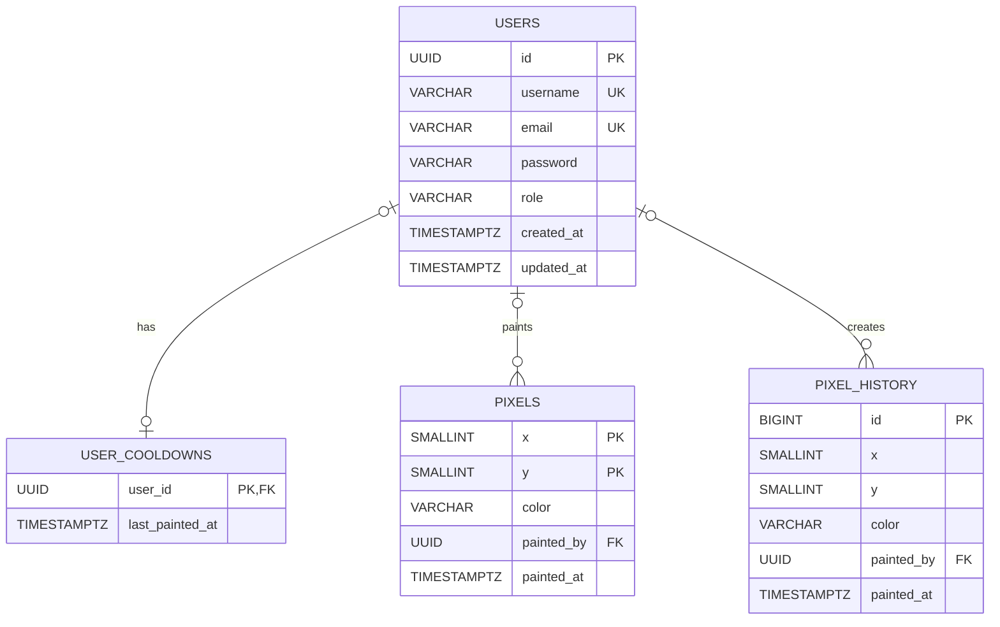

## Database schema

```mermaid
erDiagram
    USERS {
        UUID id PK
        VARCHAR username UK
        VARCHAR email UK
        VARCHAR password
        VARCHAR role
        TIMESTAMPTZ created_at
        TIMESTAMPTZ updated_at
    }

    PIXELS {
        SMALLINT x PK
        SMALLINT y PK
        VARCHAR color
        UUID painted_by FK
        TIMESTAMPTZ painted_at
    }

    USER_COOLDOWNS {
        UUID user_id PK, FK
        TIMESTAMPTZ last_painted_at
    }

    PIXEL_HISTORY {
        BIGINT id PK
        SMALLINT x
        SMALLINT y
        VARCHAR color
        UUID painted_by FK
        TIMESTAMPTZ painted_at
    }

    USERS o|--o| USER_COOLDOWNS : "has"
    USERS o|--o{ PIXELS : "paints"
    USERS o|--o{ PIXEL_HISTORY : "creates"
```